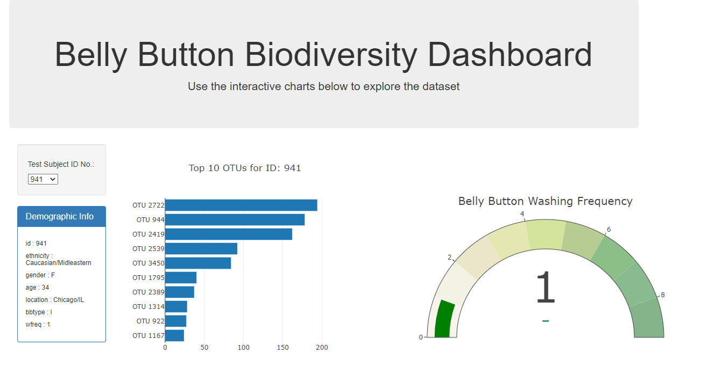

# Biodiversity
This dashbiard takes in a JSON file of sample data and displays a variety of information in several interactive plots.

### Technologies:
- Javascript (incl. plotly)
- HTML (incl. Bootstrap & d3)